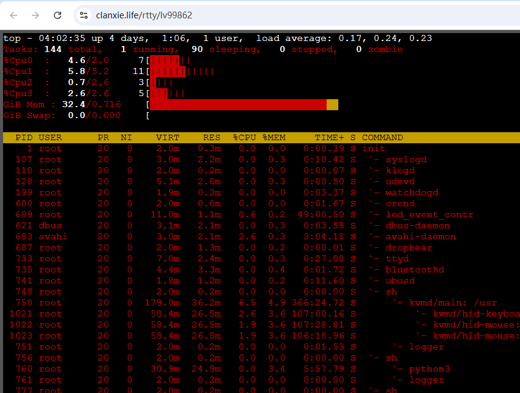
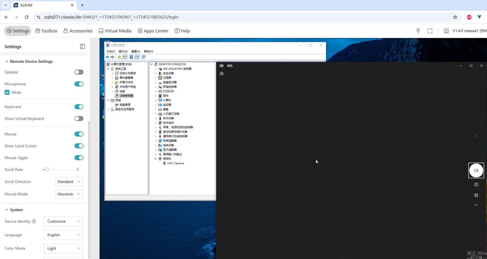

# Self-Deployed Lightweight Cloud KVM Remote Management Platform

Self-Deployed Lightweight Cloud is a lightweight KVM remote cloud platform tailored for individuals and small businesses. This project is developed based on [rttys](https://github.com/zhaojh329/rttys), specifically designed for users managing fewer than 50 KVM devices.

## Core Features

- 🚀 **Rapid Deployment** - Quick self-deployment with simple operations
- 🔒 **Data Security** - Private deployment with full data control
- 🎯 **Lightweight Design** - Optimized for small businesses and individual users
- 🌐 **Unified Management** - Centralized management and remote control via public servers
- 🏷️ **Brand Flexibility** - Minimal branding for easy customization

## Main Functions

- ✅ **User Authentication** - Secure login authentication system
- 📋 **Device Management** - Online device list monitoring
- 📜 **Script Deployment** - Convenient script-based device addition
- 🖥️ **Remote SSH** - Secure SSH remote connections
- 🎮 **Remote Control** - Graphical remote desktop control
- ⚡ **Batch Operations** - Batch command execution capabilities

## Feature Demonstrations

### Remote SSH Connection

### Remote Desktop Control

## Supported Operating Systems

The following mainstream operating systems have been tested and verified:

### Debian Family

- Ubuntu 18.04 / 20.04 / 22.04 / 24.04
- Debian 11 / 12

### Red Hat Family

- AlmaLinux 8 / 9
- Rocky Linux 8 / 9
- CentOS Stream 9

## System Requirements

### Server Configuration Requirements

| Component    | Minimum Requirement |
| ------------ | ------------------- |
| CPU          | 2 cores or above    |
| Memory       | ≥ 2 GB              |
| Storage      | ≥ 40 GB             |
| KVM Firmware | ≥ v1.5.0            |

### Recommended Scale

- **Recommended Device Count**: Under 50 devices
- **Use Cases**: Individual users, small businesses, data security-sensitive environments

## User Guide

1. Access the management interface via web browser
2. Login with administrator credentials
3. Add KVM devices to be managed
4. Begin remote management operations

## Target Audience

### Ideal for:

- **Individual Users** - Tech enthusiasts managing personal server infrastructure
- **Small Businesses** - Companies with limited IT resources needing simple KVM management
- **Security-Conscious Organizations** - Users requiring complete data control and privacy
- **Development Teams** - Teams needing lightweight, self-hosted remote access solutions

### Perfect Use Cases:

- Home lab management
- Small office server administration
- Development environment access
- Educational institutions with limited budgets
- Organizations with strict data residency requirements