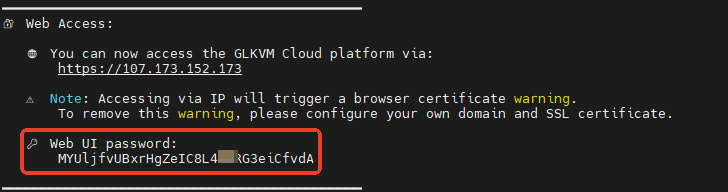
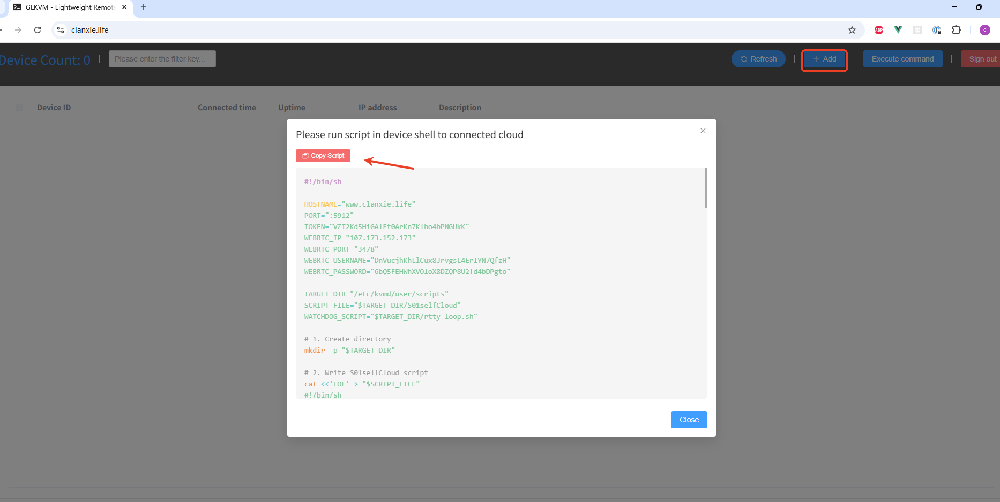
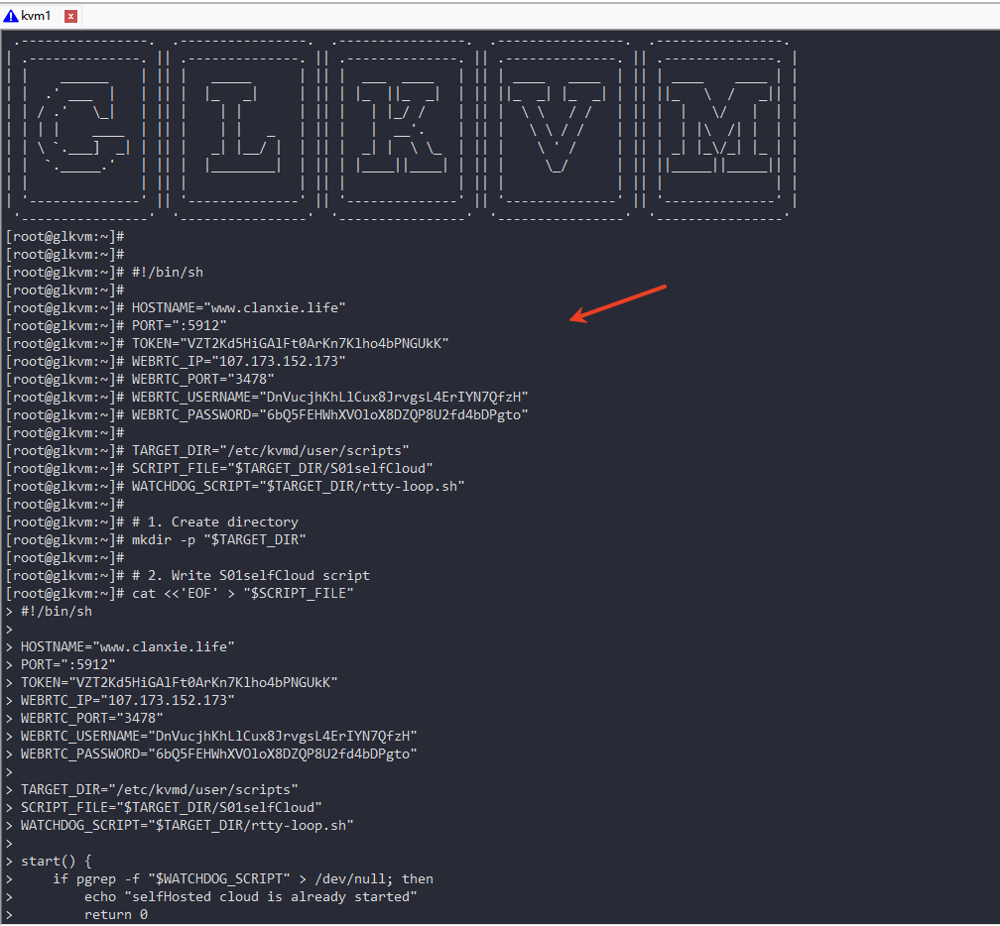
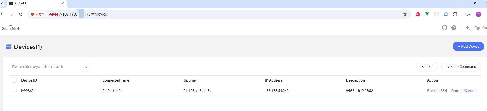

# Self-Deployed Lightweight Cloud KVM Remote Management Platform

[中文文档](./README.zh-CN.md) | English

Self-Deployed Lightweight Cloud is a lightweight KVM remote cloud platform tailored for individuals and small businesses. This project is developed based on [rttys](https://github.com/zhaojh329/rttys), designed for users who need to **quickly** build a remote access platform while prioritizing **data security**. 

#### Main Functions and Features

-  **Device Management** - Online device list monitoring
-  **Script Deployment** - Convenient script-based device addition
-  **Remote SSH** - Web SSH remote connections
-  **Remote Control** - Web remote desktop control
-  **Batch Operations** - Batch command execution capabilities
-  **Rapid Deployment** - Quick self-deployment with simple operations
-  **Data Security** - Private deployment with full data control
-  **Dedicated Bandwidth** - Exclusive bandwidth for self-hosted deployments 
-  **Lightweight Design** - Optimized for small businesses and individual users

## Self-Hosting Guide

The following mainstream operating systems have been tested and verified

#### Debian Family

- Ubuntu 18.04 / 20.04 / 22.04 / 24.04
- Debian 11 / 12

#### Red Hat Family

- AlmaLinux 8 / 9
- Rocky Linux 8 / 9
- CentOS Stream 9

#### Requirements

|      Component      | Minimum Requirement |
| :-----------------: | :-----------------: |
|         CPU         |  1 core or above   |
|       Memory        |       ≥ 1 GB        |
|       Storage       |       ≥ 40 GB       |
| Network Bandwidth   | ≥ 3 Mbps      |
| KVM Device Firmware |      ≥ v1.5.0       |

#### 🔐 Cloud Security Group Settings

If your server provider uses a **cloud security group** (e.g., AWS, Aliyun, etc.), please make sure the following ports are **open**:

| Port  | Protocol | Purpose                        |
| ----- | -------- | ------------------------------ |
| 443   | TCP      | Web UI access                  |
| 10443 | TCP      | WebSocket proxy                |
| 5912  | TCP      | Device connection              |
| 3478  | TCP/UDP  | TURN server for WebRTC support |

⚠️ **Important:**
 These ports will be **used by GLKVM Cloud**. Please ensure **no other applications or services** on your server are binding to these ports, otherwise the lightweight cloud platform may fail to start properly.

------
### 📦 Installation

We provide **two** ways to install GLKVM Cloud: 

#### A) One-line installer (recommended)

> **Note:** The one-line installer is **Docker-based**. It automates Docker/Compose setup, pulls images, renders configs from templates, and starts services for you.

Run **as root**:

```bash
( command -v curl >/dev/null 2>&1 && curl -fsSL https://kvm-cloud.gl-inet.com/selfhost/install.sh || wget -qO- https://kvm-cloud.gl-inet.com/selfhost/install.sh ) | sudo bash
```

#### B) Docker manual install

> Full reference: see [`docker-compose/README.md`](https://github.com/gl-inet/glkvm-cloud/blob/main/docker-compose/README.md)

### 🌐 Platform Access

Once the installation is complete, access the platform via:

```
https://<your_server_public_ip>
```

⚠️ **Note**: Accessing via IP address will trigger a **browser certificate warning**.
 To eliminate the warning, it's recommended to configure a **custom domain** with a valid SSL certificate.

### 🔑 Web UI Login Password

The default login password for the Web UI will be displayed in the installation script output:

```
🔐 Please check the installation console for your web login password.
```



## Feature Demonstrations

###  Add KVM Devices to the Lightweight Cloud 

- Copy script



- Run the script in the device terminal



- Devices connected to the cloud




### Remote SSH Connection


### Remote Desktop Control


##  Use your own SSL Certificate (Optional) 

⚠️ **Note**:

If you just want to **quickly try out GLKVM Cloud** and don’t mind the browser’s certificate warning,
you can **skip** configuring a custom domain and SSL certificate, and still access the platform via the server’s **public IP** with HTTPS.

For production use, or if you need to **access multiple KVM devices via subdomains**, it is **strongly recommended** to configure your own **wildcard SSL certificate** (see below).

#### 🌐 Add DNS Records

To enable full domain-based access, configure the following DNS records for your domain:

```
┌────────────┬──────┬────────────────────┬─────────────────────────────┐
│ Hostname   │ Type │     Value           │         Purpose             │
├────────────┼──────┼────────────────────┼─────────────────────────────┤
│ www        │  A   │ Your public IP      │ Web access to the platform │
│ *          │  A   │ Your public IP      │ Remote access to KVMs      │
└────────────┴──────┴────────────────────┴─────────────────────────────┘
```

#### 🔧 Using a Custom SSL Certificate

To avoid browser warnings, replace the default certificates with your own **wildcard SSL certificate**
 that supports both:

- `*.your-domain.com` (for device access)
- `www.your-domain.com` (for platform access)

Replace the following files in:

```
~/glkvm_cloud/certificate
```

- `glkvm.cer`
- `glkvm.key`

⚠️ **Make sure the filenames remain unchanged.**

#### 🔄 Restart Services After Certificate Replacement

After replacing the certificates, restart the GLKVM Cloud services to apply the changes:

```bash
cd ~/glkvm_cloud
docker-compose down && docker-compose up -d
```

Or, on systems with the Docker CLI plugin:

```bash
docker compose down && docker compose up -d
```

###  Domain-Based Access Example

Once everything is configured, you can access the platform via your domain:

```
https://www.your-domain.com
```